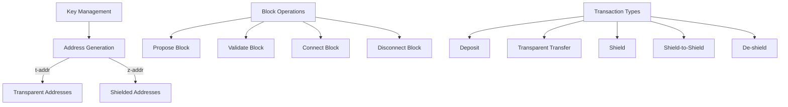

# Minimalist Orchard Protocol Implementation

This document outlines the architecture of a minimalist implementation of the Orchard protocol, focusing on essential functionality while using SQL for state management.

## Core Functionality



### Key Operations

1. **Address Management**
   - Generate cryptographic keys
   - Create transparent t-addresses
   - Create reusable shielded z-addresses

2. **Block Operations**
   - Propose new blocks
   - Validate blocks (returns true/false)
   - Connect valid blocks (updates global state)
   - Disconnect blocks (revert global state)

3. **Transaction Flow**
   - Deposit: Create new coins (simplified for testing)
   - Transparent: t-addr → t-addr transfer
   - Shield: t-addr → z-addr transfer
   - Shield-to-Shield: z-addr → z-addr transfer
   - De-shield: z-addr → t-addr transfer

## Database Schema

### Address Management
```sql
CREATE TABLE keys (
    key_id BLOB PRIMARY KEY,
    key_type TEXT NOT NULL,  -- 'transparent' or 'shielded'
    private_key BLOB NOT NULL,
    public_key BLOB NOT NULL,
    created_at INTEGER NOT NULL
);

CREATE TABLE addresses (
    address_id BLOB PRIMARY KEY,
    key_id BLOB NOT NULL,
    address_type TEXT NOT NULL,  -- 't-addr' or 'z-addr'
    address_data BLOB NOT NULL,  -- encoded address
    FOREIGN KEY(key_id) REFERENCES keys(key_id)
);
```

### Block Storage
```sql
CREATE TABLE blocks (
    height INTEGER PRIMARY KEY,
    hash BLOB NOT NULL,
    parent_hash BLOB NOT NULL,
    timestamp INTEGER NOT NULL,
    merkle_root BLOB NOT NULL,
    status TEXT NOT NULL  -- 'active', 'orphaned'
);

CREATE INDEX idx_blocks_hash ON blocks(hash);
CREATE INDEX idx_blocks_parent ON blocks(parent_hash);
```

### Transaction Management
```sql
CREATE TABLE transactions (
    tx_hash BLOB PRIMARY KEY,
    block_height INTEGER NOT NULL,
    tx_type TEXT NOT NULL,  -- 'deposit', 'transparent', 'shield', 'shield_to_shield', 'deshield'
    raw_data BLOB NOT NULL,
    proof_data BLOB,  -- NULL for transparent transactions
    FOREIGN KEY(block_height) REFERENCES blocks(height)
);

CREATE TABLE transparent_outputs (
    output_id BLOB PRIMARY KEY,
    tx_hash BLOB NOT NULL,
    address BLOB NOT NULL,
    amount INTEGER NOT NULL,
    spent_in_tx BLOB,  -- NULL if unspent
    FOREIGN KEY(tx_hash) REFERENCES transactions(tx_hash),
    FOREIGN KEY(spent_in_tx) REFERENCES transactions(tx_hash)
);

CREATE TABLE shielded_notes (
    note_commitment BLOB PRIMARY KEY,
    ephemeral_key BLOB NOT NULL,
    amount BLOB NOT NULL,  -- encrypted
    memo BLOB,
    nullifier BLOB,  -- NULL if unspent
    tx_hash BLOB NOT NULL,
    block_height INTEGER NOT NULL,
    merkle_position INTEGER NOT NULL,
    FOREIGN KEY(tx_hash) REFERENCES transactions(tx_hash),
    FOREIGN KEY(block_height) REFERENCES blocks(height)
);
```

### State Management
```sql
CREATE TABLE nullifier_set (
    nullifier BLOB PRIMARY KEY,
    block_height INTEGER NOT NULL,
    tx_hash BLOB NOT NULL,
    FOREIGN KEY(block_height) REFERENCES blocks(height),
    FOREIGN KEY(tx_hash) REFERENCES transactions(tx_hash)
);

CREATE TABLE merkle_tree (
    height INTEGER NOT NULL,
    position INTEGER NOT NULL,
    hash BLOB NOT NULL,
    block_height INTEGER NOT NULL,
    is_active BOOLEAN NOT NULL DEFAULT true,
    PRIMARY KEY(height, position),
    FOREIGN KEY(block_height) REFERENCES blocks(height)
);

CREATE TABLE chain_state (
    key TEXT PRIMARY KEY,
    value BLOB NOT NULL,
    last_updated INTEGER NOT NULL
);
```

## Implementation Guidelines

### Block Connection Flow
1. Validate block structure and transactions
2. Begin SQL transaction
3. Insert block data
4. Process transactions:
   - Update UTXO set for transparent transactions
   - Update note commitments for shielded transactions
   - Update Merkle tree
   - Add nullifiers
5. Update chain state
6. Commit SQL transaction

### Block Disconnection Flow
1. Begin SQL transaction
2. Identify affected transactions
3. Revert state changes:
   - Remove nullifiers
   - Revert Merkle tree
   - Restore previous UTXO state
   - Mark notes as unspent
4. Update chain state
5. Mark block as orphaned
6. Commit SQL transaction

### Transaction Validation
1. **Transparent Transactions**
   - Verify input UTXOs exist and are unspent
   - Verify signatures
   - Verify amount balance

2. **Shielded Transactions**
   - Verify zk-SNARK proofs
   - Check nullifiers are unused
   - Verify note commitments
   - Update Merkle tree

## Testing Strategy

### Key Test Scenarios

1. **Address Creation and Management**
   - Generate t-addresses and z-addresses
   - Verify address derivation
   - Test key storage and retrieval

2. **Block Operations**
   - Create valid and invalid blocks
   - Test block connection/disconnection
   - Verify state consistency after reorganization

3. **Transaction Flow Testing**
   ```
   [Deposit] -> t-addr A
        ↓
   [Transfer] -> t-addr B
        ↓
   [Shield] -> z-addr X
        ↓
   [Shield-to-Shield] -> z-addr Y
        ↓
   [De-shield] -> t-addr A
   ```

4. **State Management**
   - Verify UTXO set consistency
   - Test nullifier set updates
   - Validate Merkle tree operations
   - Check transaction history

### Test Implementation
- Unit tests for each component
- Integration tests for transaction flows
- Property-based tests for state consistency
- Stress tests for block reorganization

## Dependencies

- `orchard`: Core zk-SNARK operations
- `rusqlite`: SQLite database management
- Additional crates for cryptographic operations

## Future Considerations

1. **Performance Optimization**
   - Index tuning
   - Caching strategies
   - Batch operations

2. **Security Hardening**
   - Transaction validation
   - State consistency checks
   - Error handling

3. **Extended Functionality**
   - Multi-signature support
   - Enhanced memo field usage
   - Additional transaction types
